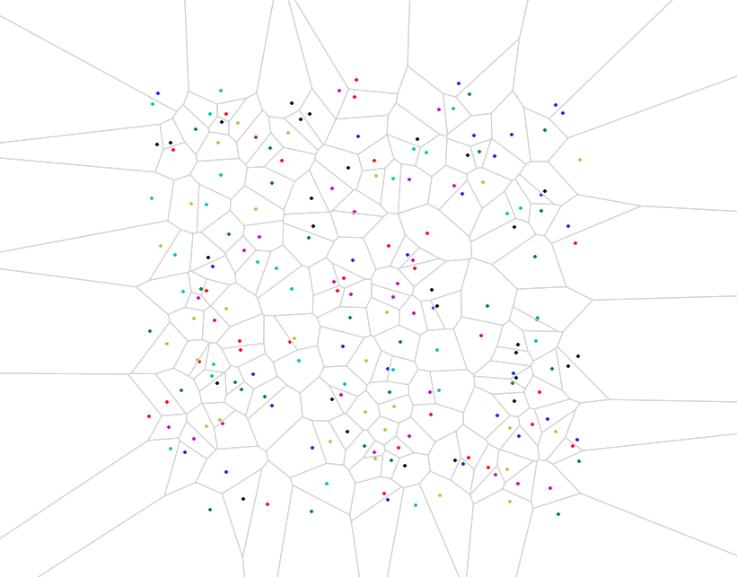

# C++ implementation of Voronoi diagram for points.

Implementation of Fortune's sweep line algorithm :
* S. Fortune, "A sweepline algorithm for Voronoi diagrams", Algorithmica, 1986

<\br>
Main features:
* xCode project;
* No dependencies on external libraries (except visualization);
* Visualization using matplotlib for C++ (header only), however (I think) python is required!

